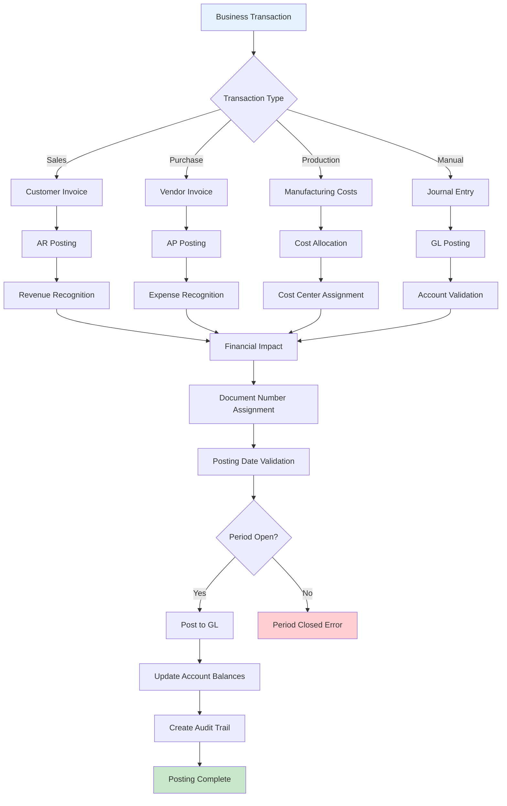
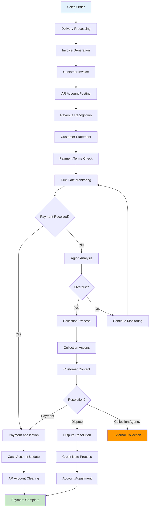
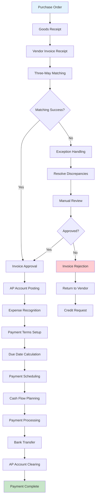
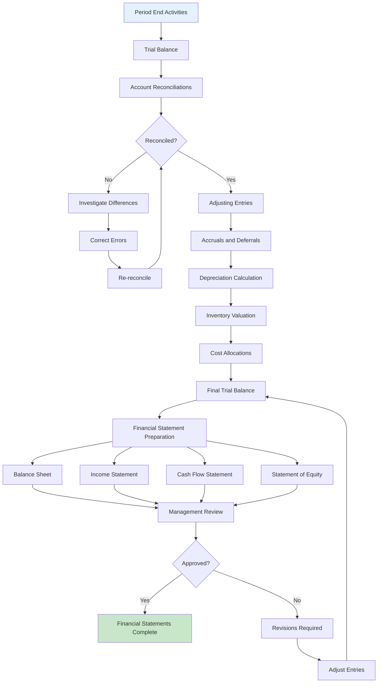
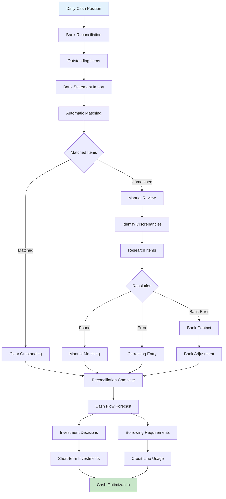
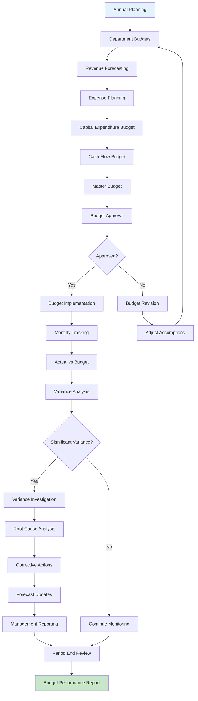

# Finance Module Flow Chart

## General Ledger Posting Process

## Accounts Receivable Process

## Accounts Payable Process

## Financial Reporting Process

## Cash Management Flow

## Budget Management Process

