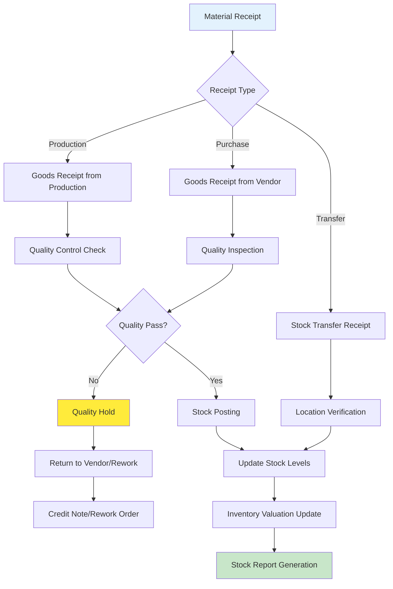
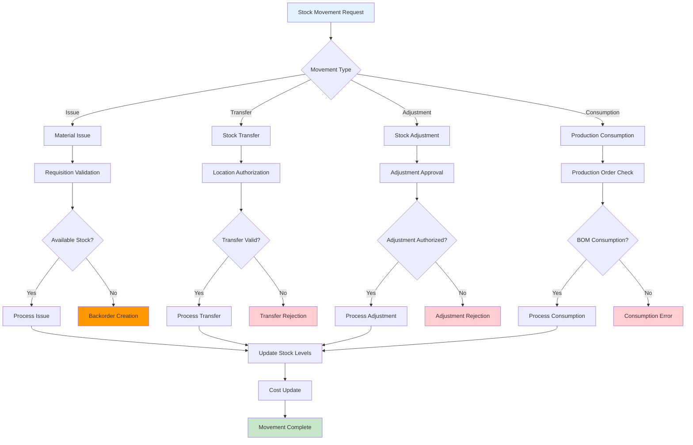
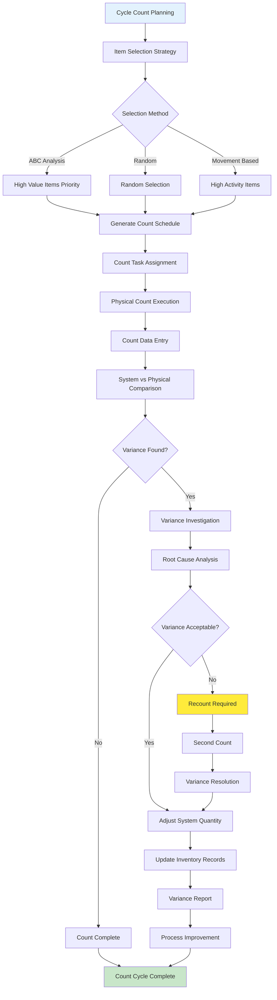
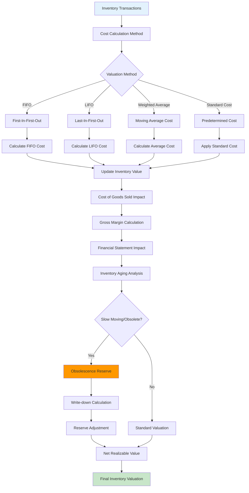
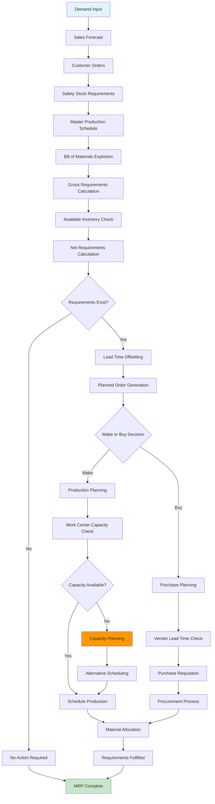

# Inventory Module Flow Chart

## Inventory Management Process

```mermaid
flowchart TD
    A[Material Receipt] --> B{Receipt Type}
    B -->|Purchase| C[Goods Receipt from Vendor]
    B -->|Production| D[Goods Receipt from Production]
    B -->|Transfer| E[Stock Transfer Receipt]
    
    C --> F[Quality Inspection]
    D --> G[Quality Control Check]
    E --> H[Location Verification]
    
    F --> I{Quality Pass?}
    G --> I
    I -->|Yes| J[Stock Posting]
    I -->|No| K[Quality Hold]
    
    K --> L[Return to Vendor/Rework]
    L --> M[Credit Note/Rework Order]
    
    H --> N[Update Stock Levels]
    J --> N
    N --> O[Inventory Valuation Update]
    O --> P[Stock Report Generation]
    
    style A fill:#e3f2fd
    style P fill:#c8e6c9
    style K fill:#ffeb3b
```

## Stock Movement Process

```mermaid
flowchart TD
    A[Stock Movement Request] --> B{Movement Type}
    B -->|Issue| C[Material Issue]
    B -->|Transfer| D[Stock Transfer]
    B -->|Adjustment| E[Stock Adjustment]
    B -->|Consumption| F[Production Consumption]
    
    C --> G[Requisition Validation]
    D --> H[Location Authorization]
    E --> I[Adjustment Approval]
    F --> J[Production Order Check]
    
    G --> K{Available Stock?}
    H --> L{Transfer Valid?}
    I --> M{Adjustment Authorized?}
    J --> N{BOM Consumption?}
    
    K -->|Yes| O[Process Issue]
    K -->|No| P[Backorder Creation]
    L -->|Yes| Q[Process Transfer]
    L -->|No| R[Transfer Rejection]
    M -->|Yes| S[Process Adjustment]
    M -->|No| T[Adjustment Rejection]
    N -->|Yes| U[Process Consumption]
    N -->|No| V[Consumption Error]
    
    O --> W[Update Stock Levels]
    Q --> W
    S --> W
    U --> W
    W --> X[Cost Update]
    X --> Y[Movement Complete]
    
    style A fill:#e3f2fd
    style Y fill:#c8e6c9
    style P fill:#ff9800
    style R fill:#ffcdd2
    style T fill:#ffcdd2
    style V fill:#ffcdd2
```

## Cycle Counting Process

```mermaid
flowchart TD
    A[Cycle Count Planning] --> B[Item Selection Strategy]
    B --> C{Selection Method}
    C -->|ABC Analysis| D[High Value Items Priority]
    C -->|Random| E[Random Selection]
    C -->|Movement Based| F[High Activity Items]
    
    D --> G[Generate Count Schedule]
    E --> G
    F --> G
    
    G --> H[Count Task Assignment]
    H --> I[Physical Count Execution]
    I --> J[Count Data Entry]
    J --> K[System vs Physical Comparison]
    
    K --> L{Variance Found?}
    L -->|No| M[Count Complete]
    L -->|Yes| N[Variance Investigation]
    
    N --> O[Root Cause Analysis]
    O --> P{Variance Acceptable?}
    P -->|Yes| Q[Adjust System Quantity]
    P -->|No| R[Recount Required]
    
    R --> S[Second Count]
    S --> T[Variance Resolution]
    T --> Q
    
    Q --> U[Update Inventory Records]
    U --> V[Variance Report]
    V --> W[Process Improvement]
    M --> X[Count Cycle Complete]
    W --> X
    
    style A fill:#e3f2fd
    style X fill:#c8e6c9
    style R fill:#ffeb3b
```

## Inventory Valuation Flow

```mermaid
flowchart TD
    A[Inventory Transactions] --> B[Cost Calculation Method]
    B --> C{Valuation Method}
    C -->|FIFO| D[First-In-First-Out]
    C -->|LIFO| E[Last-In-First-Out]
    C -->|Weighted Average| F[Moving Average Cost]
    C -->|Standard Cost| G[Predetermined Cost]
    
    D --> H[Calculate FIFO Cost]
    E --> I[Calculate LIFO Cost]
    F --> J[Calculate Average Cost]
    G --> K[Apply Standard Cost]
    
    H --> L[Update Inventory Value]
    I --> L
    J --> L
    K --> L
    
    L --> M[Cost of Goods Sold Impact]
    M --> N[Gross Margin Calculation]
    N --> O[Financial Statement Impact]
    O --> P[Inventory Aging Analysis]
    
    P --> Q{Slow Moving/Obsolete?}
    Q -->|Yes| R[Obsolescence Reserve]
    Q -->|No| S[Standard Valuation]
    
    R --> T[Write-down Calculation]
    T --> U[Reserve Adjustment]
    U --> V[Net Realizable Value]
    S --> V
    V --> W[Final Inventory Valuation]
    
    style A fill:#e3f2fd
    style W fill:#c8e6c9
    style R fill:#ff9800
```

## Material Requirements Planning (MRP)

```mermaid
flowchart TD
    A[Demand Input] --> B[Sales Forecast]
    B --> C[Customer Orders]
    C --> D[Safety Stock Requirements]
    D --> E[Master Production Schedule]
    
    E --> F[Bill of Materials Explosion]
    F --> G[Gross Requirements Calculation]
    G --> H[Available Inventory Check]
    H --> I[Net Requirements Calculation]
    
    I --> J{Requirements Exist?}
    J -->|No| K[No Action Required]
    J -->|Yes| L[Lead Time Offsetting]
    
    L --> M[Planned Order Generation]
    M --> N{Make or Buy Decision}
    N -->|Make| O[Production Planning]
    N -->|Buy| P[Purchase Planning]
    
    O --> Q[Work Center Capacity Check]
    Q --> R{Capacity Available?}
    R -->|Yes| S[Schedule Production]
    R -->|No| T[Capacity Planning]
    T --> U[Alternative Scheduling]
    U --> S
    
    P --> V[Vendor Lead Time Check]
    V --> W[Purchase Requisition]
    W --> X[Procurement Process]
    
    S --> Y[Material Allocation]
    X --> Y
    Y --> Z[Requirements Fulfilled]
    K --> AA[MRP Complete]
    Z --> AA
    
    style A fill:#e3f2fd
    style AA fill:#c8e6c9
    style T fill:#ff9800
```