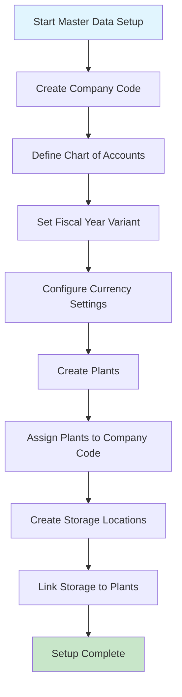
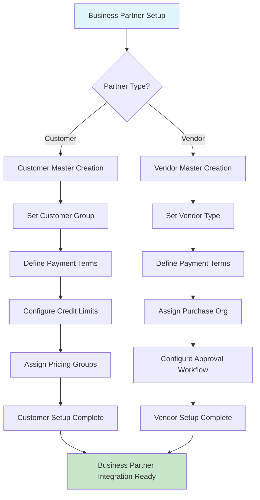
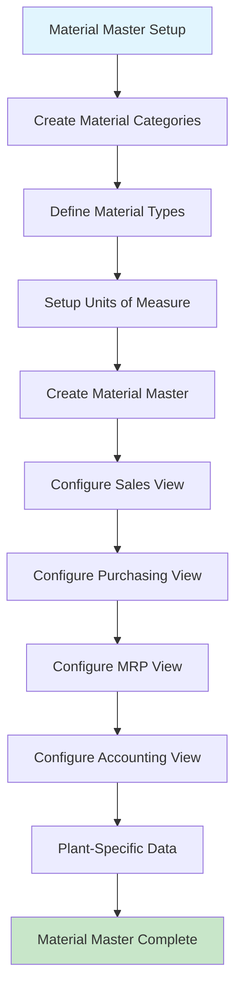
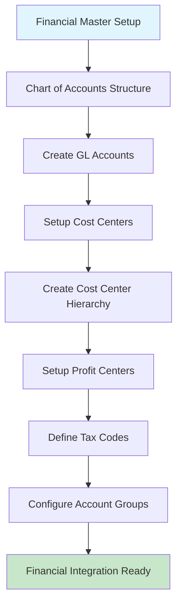
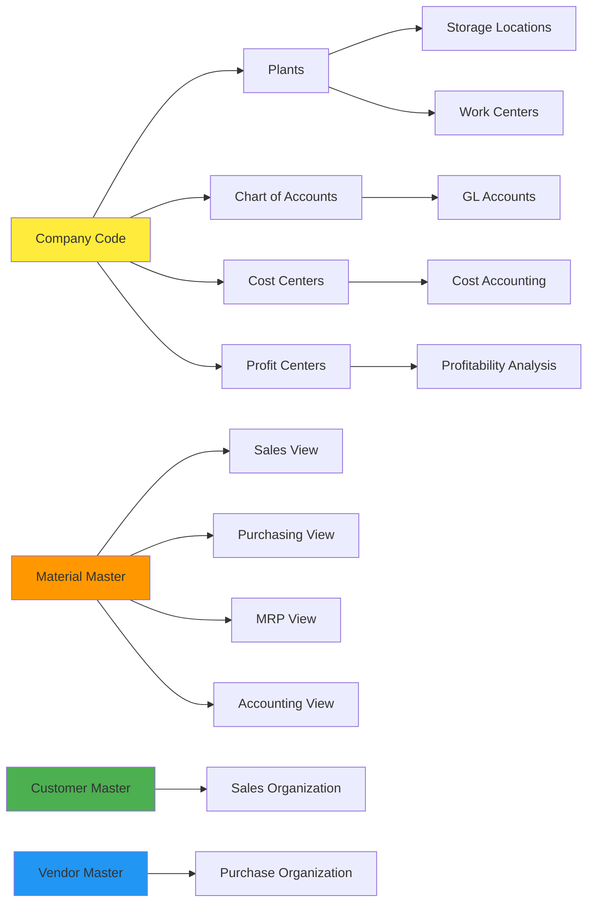

# Master Data Management Flow Chart

## Organizational Structure Setup Flow

## Business Partner Master Data Flow

## Material Master Data Flow

## Financial Master Data Integration Flow

## Master Data Dependencies Map

