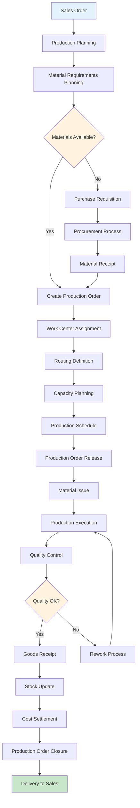
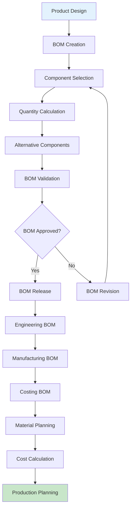
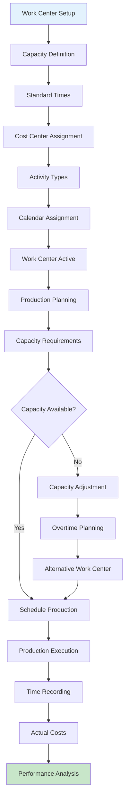
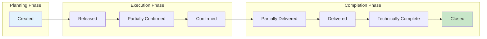
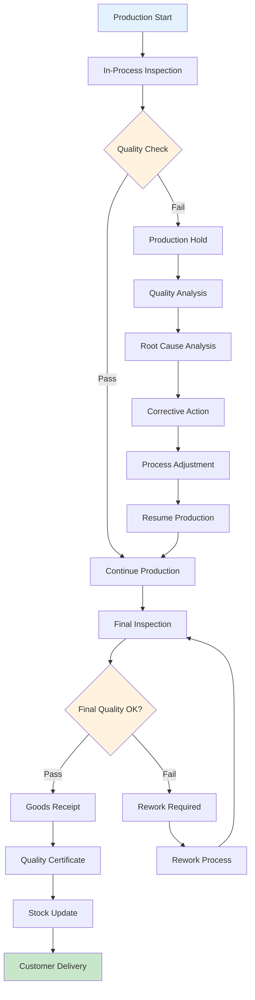
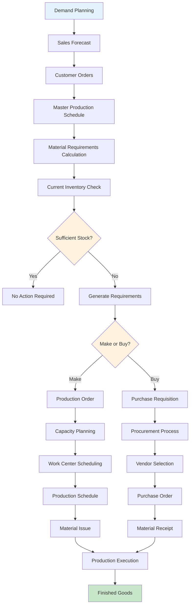

# Production Module Flow Chart

## Make to Order Production Process

## Bill of Materials (BOM) Management

## Work Center Management Flow

## Production Order Lifecycle

## Quality Control Integration

## Manufacturing Resource Planning (MRP)

