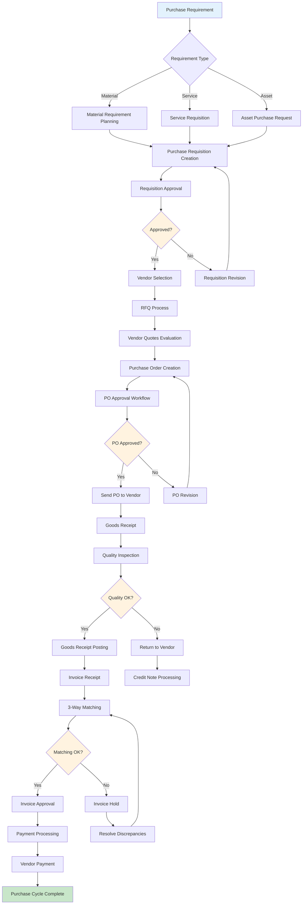
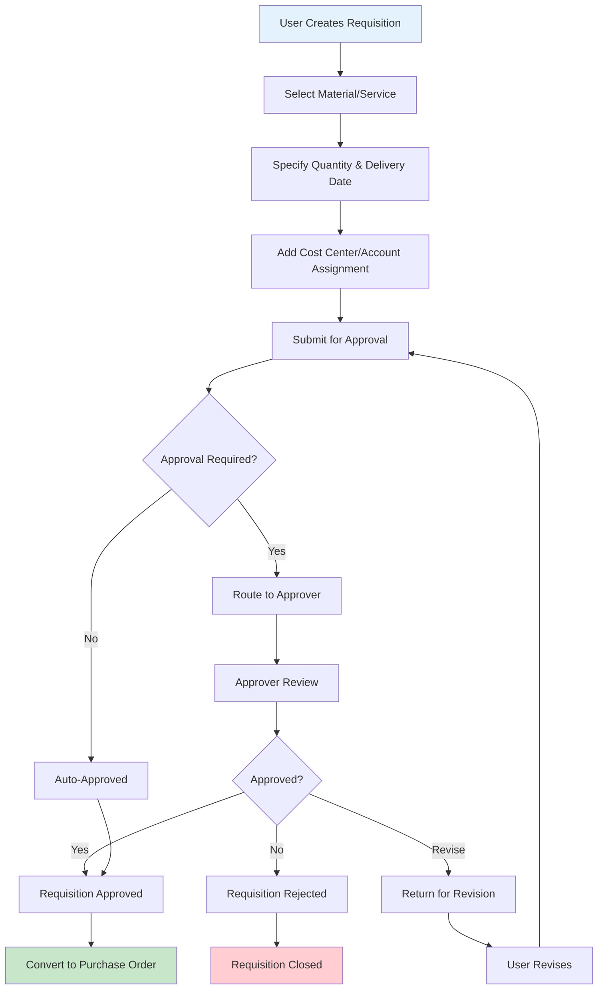
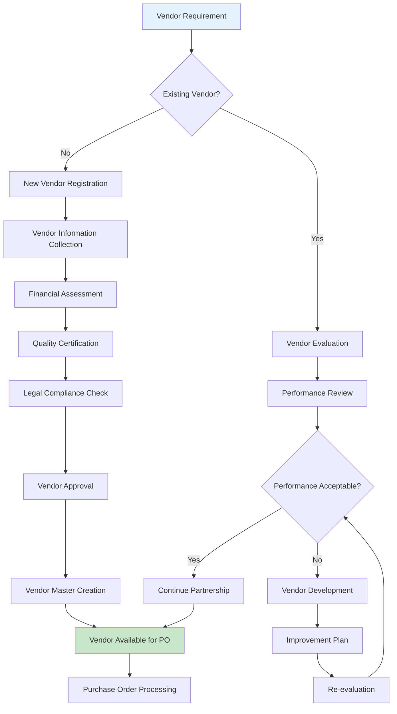
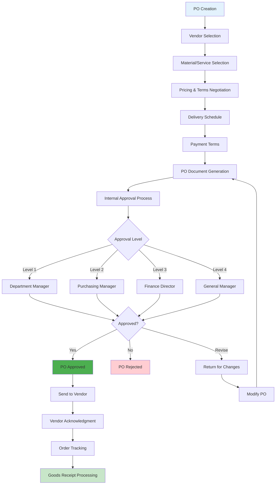
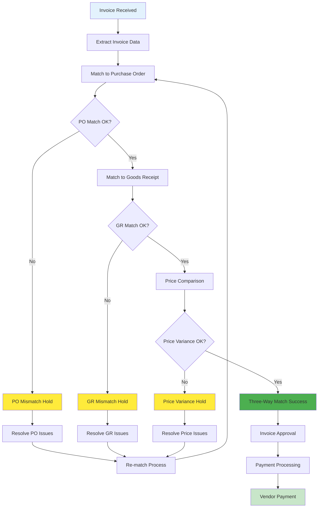
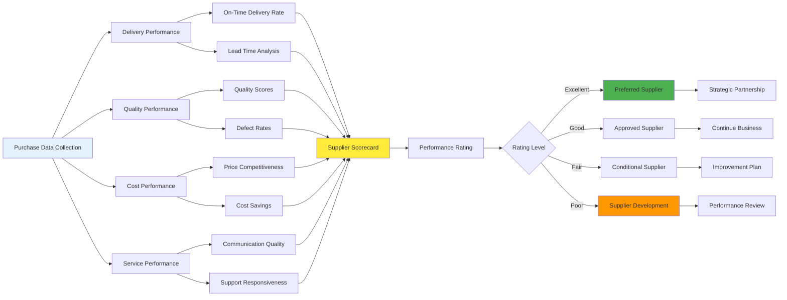

# Purchase Module Flow Chart

## Procure to Pay Complete Process Flow

## Purchase Requisition Workflow

## Vendor Management Integration

## Purchase Order Processing Flow

## Three-Way Matching Process

## Supplier Performance Management

