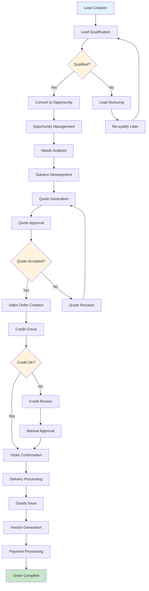
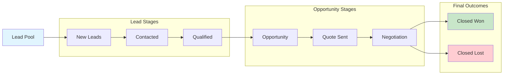
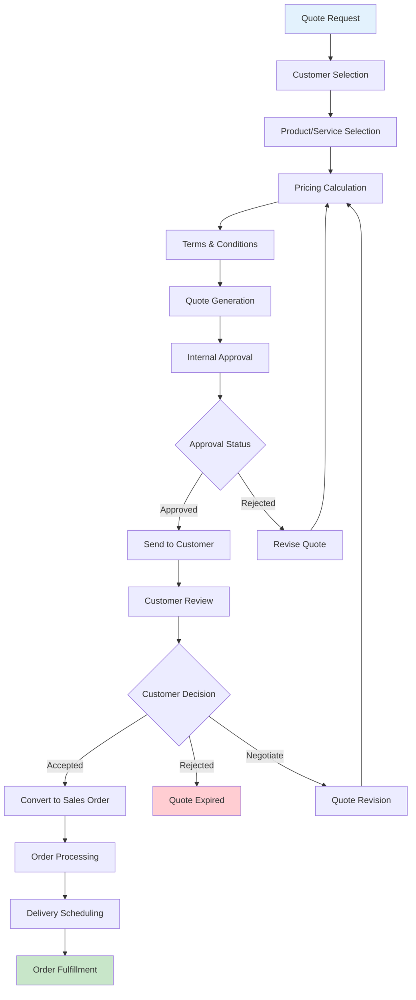
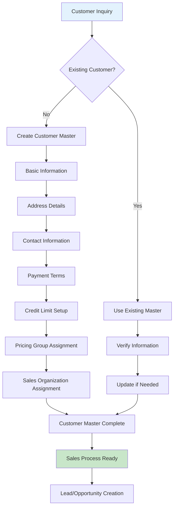
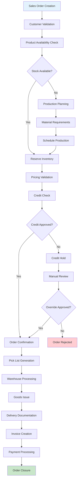
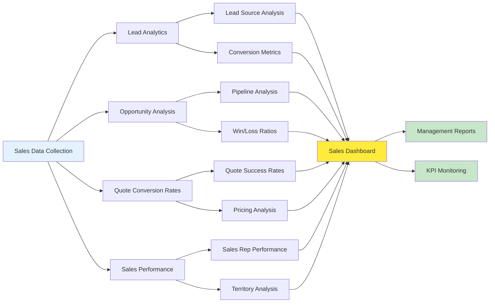

# Sales Module Flow Chart

## Lead to Cash Complete Process Flow

## Sales Pipeline Management

## Quote to Order Conversion Process

## Customer Master Integration Flow

## Sales Order Processing Workflow

## Sales Analytics and Reporting Flow

