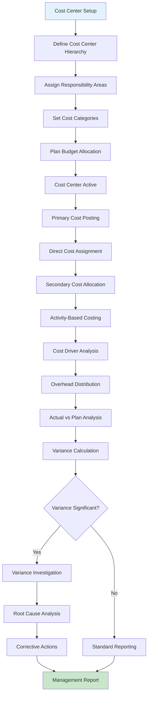
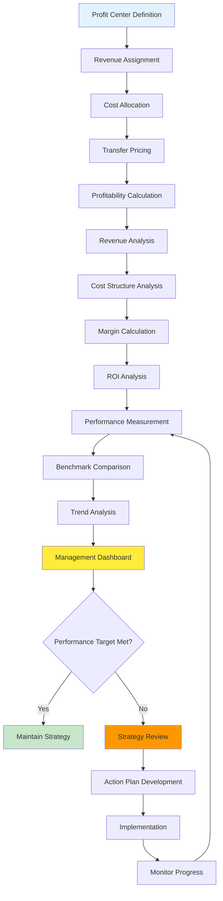
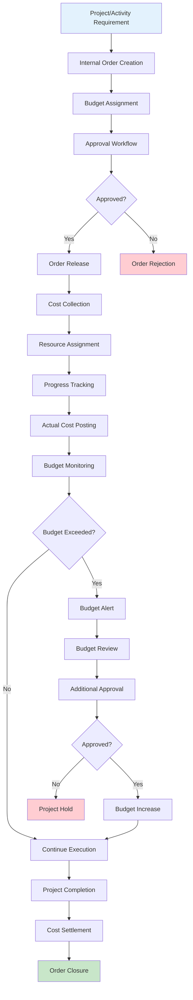
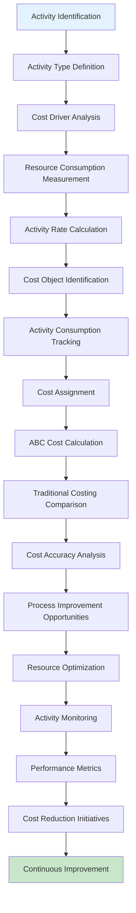
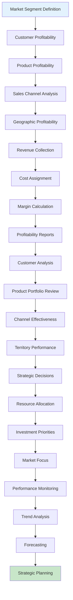
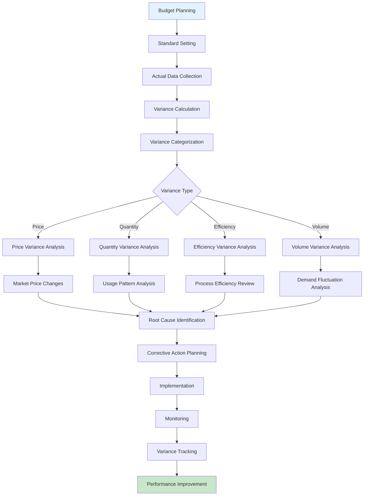
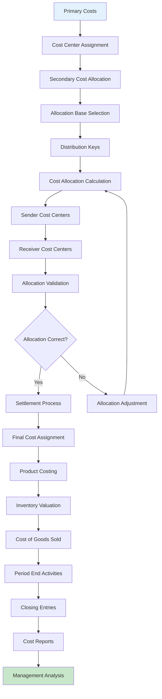

# Controlling Business Domain Flow Chart

## Cost Center Accounting Process

## Profit Center Accounting Flow

## Internal Orders Process

## Activity-Based Costing (ABC) Flow

## Profitability Analysis (CO-PA) Process

## Variance Analysis Workflow

## Cost Allocation and Settlement

