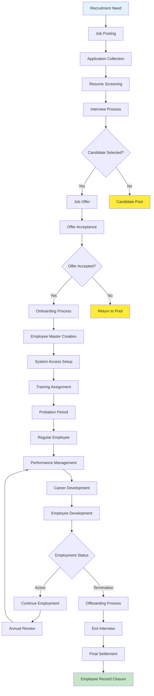
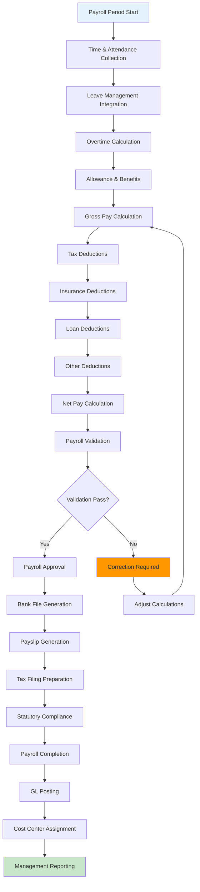
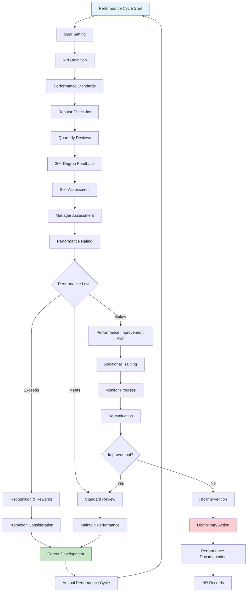
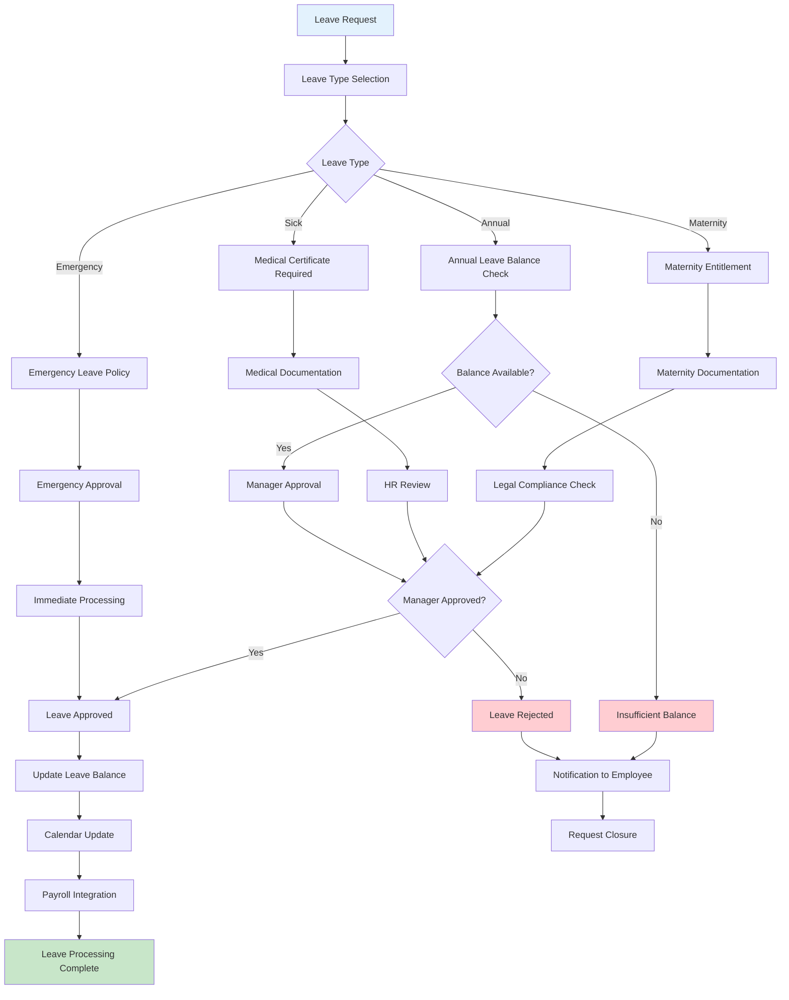
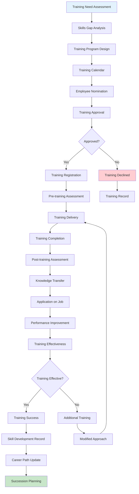

# HR Business Domain Flow Chart

## Employee Lifecycle Management

## Payroll Processing Flow

## Performance Management Process

## Leave Management Workflow

## Training and Development Flow

