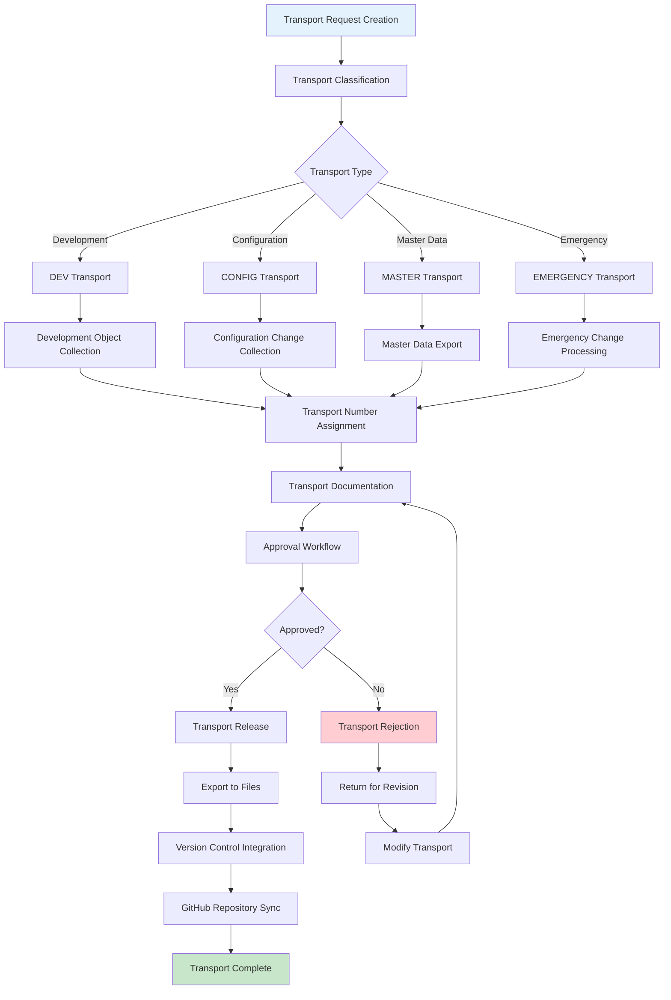
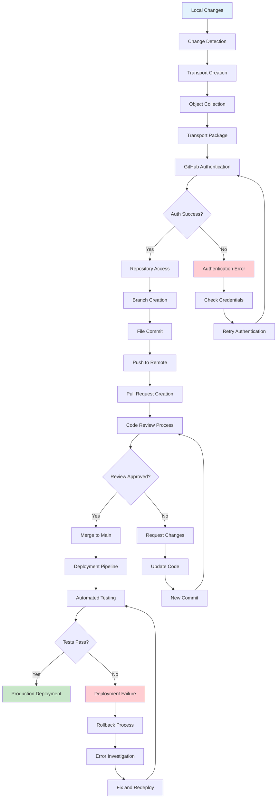
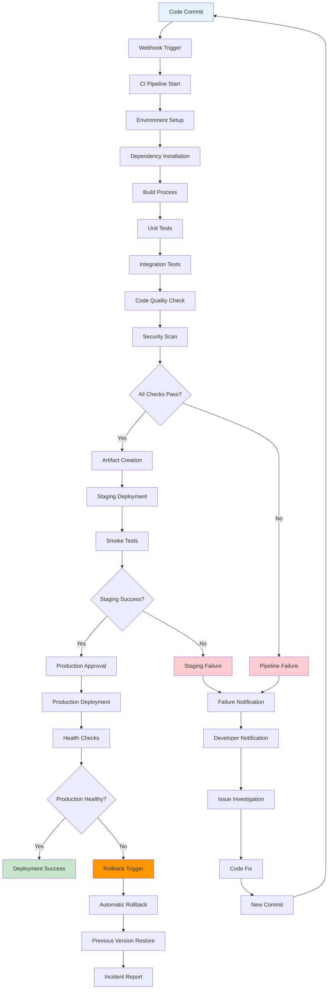
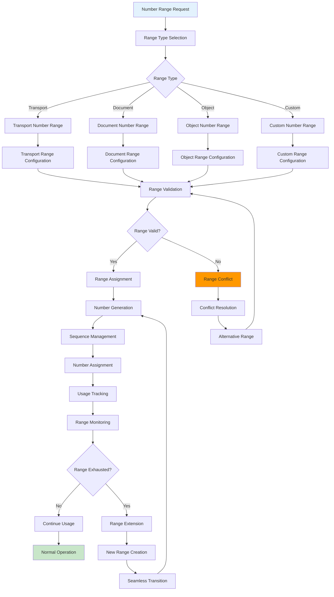
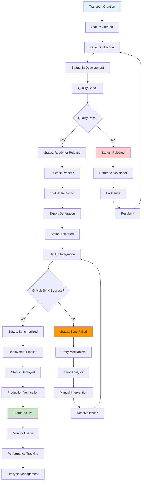
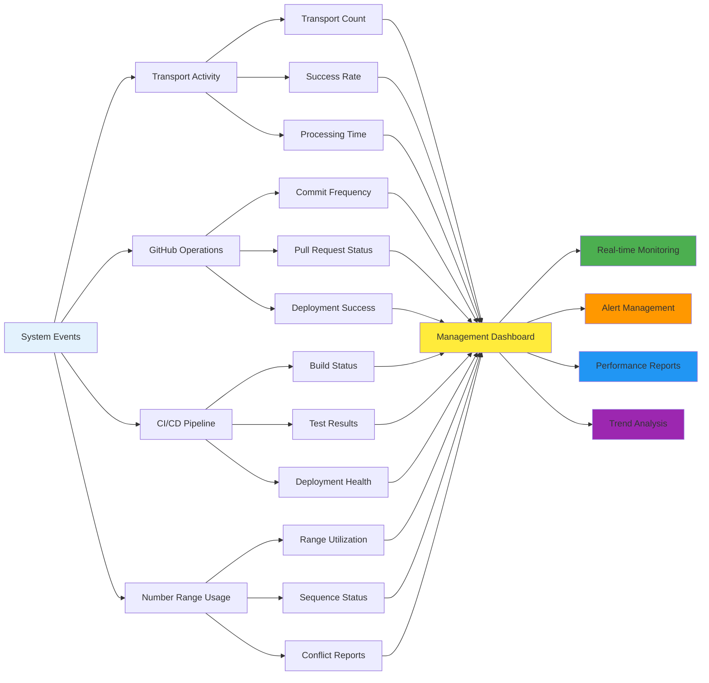

# Transport & GitHub Integration Flow Chart

## Transport System Workflow

## GitHub Integration Process

## CI/CD Pipeline Integration

## Number Range Management

## Transport Status Management

## Integration Monitoring Dashboard

